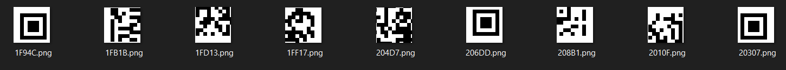
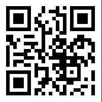
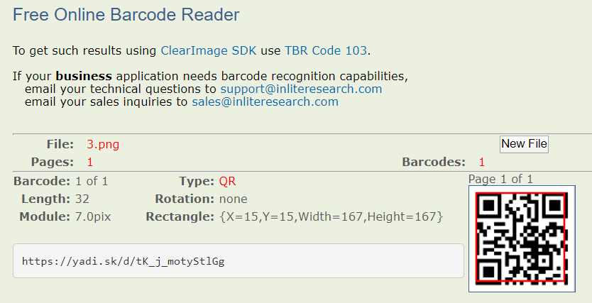
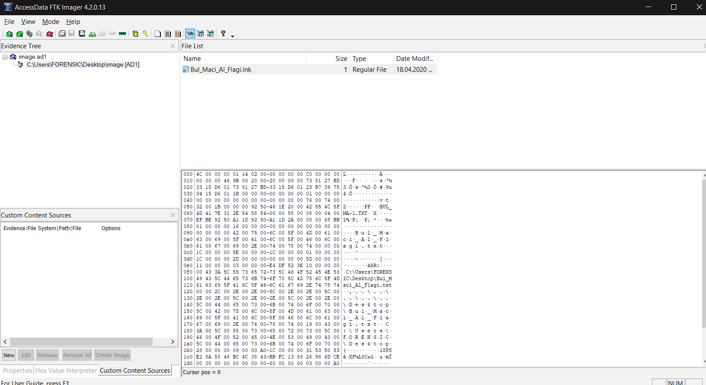
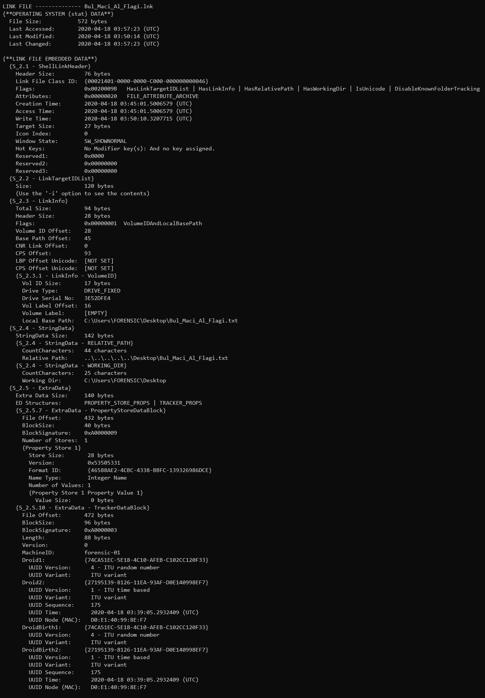

# YIYORSA FIZIKSEL ADRESINI VER
Verilen `Akincilar.png.zip` dosyasını extract ettim ve png dosyasına ulaştım. Ardından png dosyasının içerisine başka png dosyaları sıkıştırıldığını farkettim. Sonrasında `binwalk -D 'png image:png' Akincilar_CTF.png` komutu ile bu dosyaları extract ettim.

Ve png dosyasının içerisinden çıkardığım bu png dosyalarının 9 parçaya bölünmüş bir qr code olduğunu farkettikten sonra paint yardımı ile bu görselleri birleştirdim.



Sonrasında [bu bağlantı](https://online-barcode-reader.inliteresearch.com/)yı kullanarak qr dosyasının içeriğindeki linki elde ettim.


QR ile verilen yadi.sk linkiden `image.ad1` dosyasını indirdim. `FTK Imager` aracını kullanarak bu dosyayı görüntülediğimde içeriğinde `Bul_Maci_Al_Flagi` isminde bir lnk dosyası vardı.

Bu dosyayı elde ettikten sonra sonraki adımı bulmam gerçekten uzun sürdü. Lnk dosyasından MAC adresini bulmaya yarıyan birkaç araç buldum ancak ücretliydi. Ardından [lifer](https://github.com/Paul-Tew/lifer) aracını keşfettim.

Ve çıktının ardından mac adresini flage girdim ve başarılı oldum!

Flag
```
SANCAK{D0:E1:40:99:8E:F7}
```