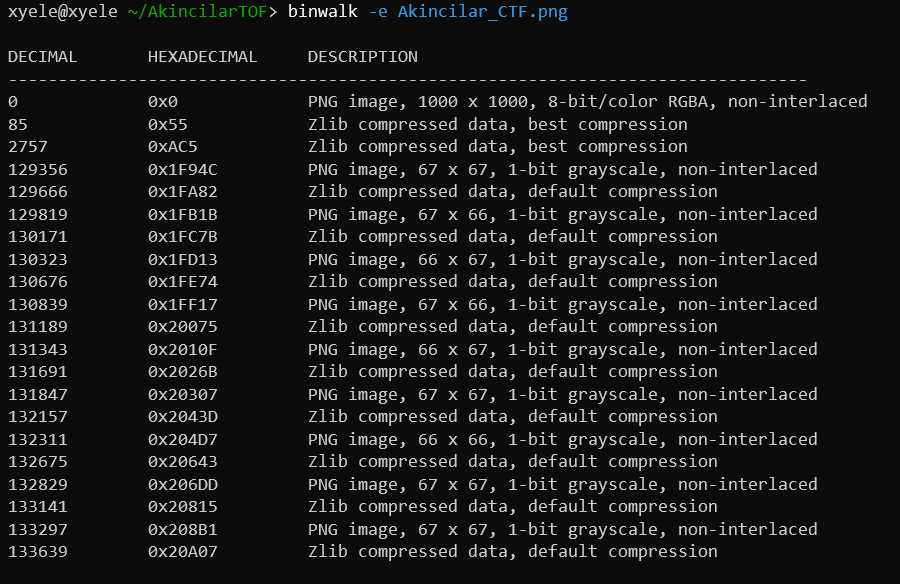

# YIYORSA FIZIKSEL ADRESINI VER
Verilen `Akincilar.png.zip` dosyasını extract ettim ve png dosyasına ulaştım. Ardından png dosyasının içerisine başka png dosyaları sıkıştırıldığını farkettim. Binwalk aracının `-e` parametresi ile bu dosyaları çıkardım.

