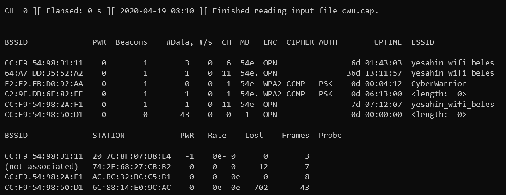

# UPTIME
Soruda bize cap dosyası verip kullanıcının bağlı olduğu kablosuz erişim noktasının ne kadar süredir aktif olduğunu hh:mm:ss formatında soruyordu. Ardından `airodump-ng -r cwu.cap --uptime` komutunu çalıştırdım.

Komut çıktısına göre `CyberWarior` networkünün uptime süresi `00:04:12` idi ve böylece flagı elde etmiş oldum.

Flag
```
SANCAK{00:04:12}
```