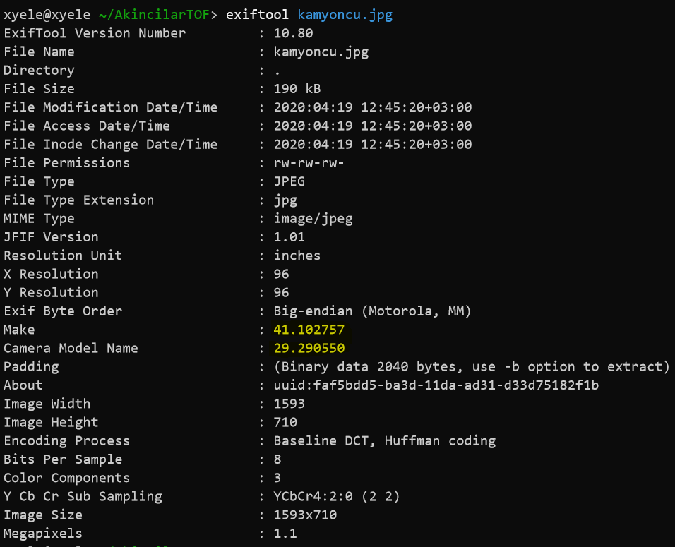

# KAMYONCU DAYI
Soru açıklaması
```
Kamyoncu Dayı'nın oğlu Emirhan sanırım bizim işlere aşina. İhlal numarasıyla birşeyler saklıyor.
```
Soruda bize bir jpg dosyası verilmişti. Ilk işim `exiftool` çalıştırmak oldu.

Exif verisindeki `Make` ve `Camera Model Name` değerleriyle `41.102757,29.290550` kordinatlarını elde ettim. Daha sonra bu kordinatları google maps üzerinden arattım.

Ardından soruda sorulan ihlal kodunun plaka üzerinden [bu adresten](https://webihlaltakip.kgm.gov.tr/WebIhlalSorgulama/Sayfalar/Sorgulama) sorgulanabildiğini farkettim. Artık ne arayacağımı biliyordum ancak bir problem vardı: google kendi kaydettiği 360 streetview görüntülerinde plakaları sansürlüyordu. Sonrasında kullanıcılar tarafından yüklenen fotoğrafları kurcalarken plakaların sansürlenmediğini farkettim. Sonrasında ise etraftaki dükkan-mağaza-restoran ne varsa fotoğraflarını incelemeye başladım. İlk önce `Köfteci Yusuf`ın fotoğraflarını incelerken bir iki tırın plakasına ulaştım, ancak çok fazla ihlal vardı bu yüzden atladım. Görselleri incelemeye devam ederken `Volvo yardım` kullanıcısın yüklediği 360 görselde plakasının altında `Emirhan` yazan bir kamyon buldum. Aradığım şeyi bulduğumu anladım :)

Hemen ardından bu plakayı (34 VK 0493) karayolları genel müdürlüğünün sitesinde arattım ve yalnızca 3 ihlal kaydı vardı. İlk ihlalin HGS bilgisine tıkladım ve ihlal numarasını elde ettim. Böylece flagi bulmuş oldum :)

Flag
```
SANCAK{0010510260032018100408334614}
```