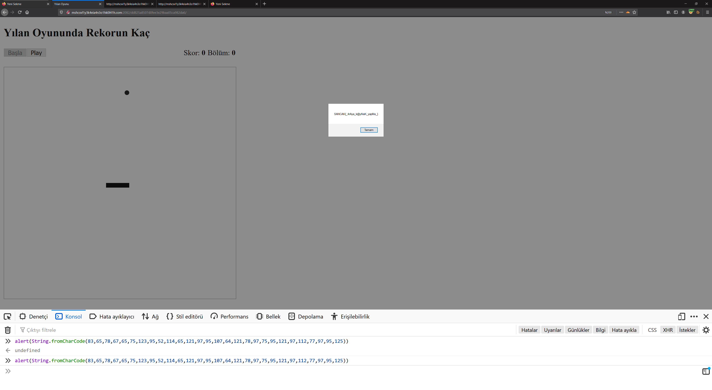

# BACKHAND

Verilen web sayfasına girdiğimde karşıma yılan oyunu çıktı. Daha sonra kaynak kodlarına girince `height` ve `widht` değerlerine `0px` verilmiş aşağıdaki img tagini buldum.

Daha sonra onclick eventindeki değeri tarayıcı konsoluma yapıştırıp flagi elde ettim.


Flag
```
SANCAK{_4rAya_k@yNaK_yapMa_}
```