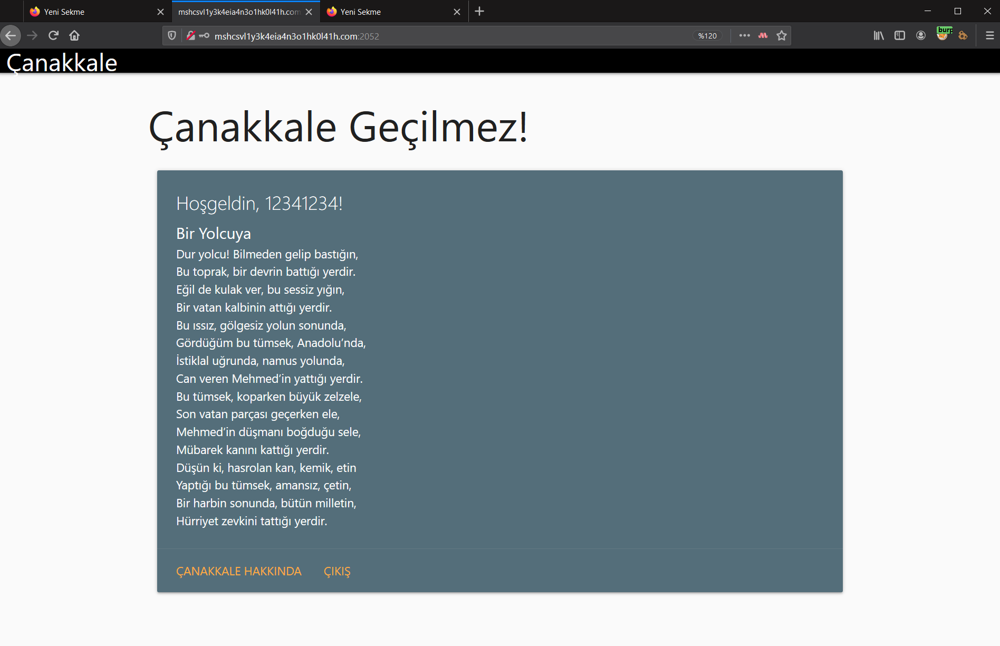
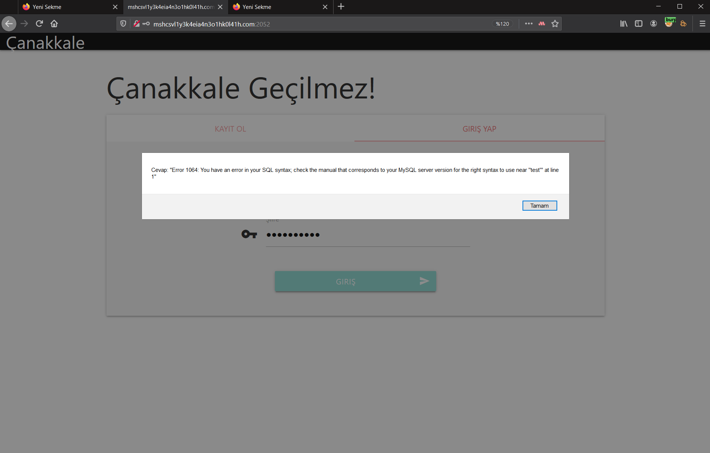
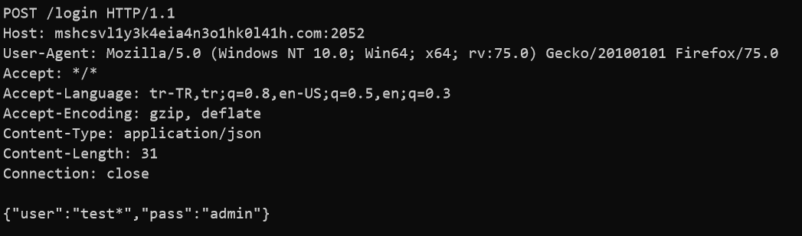

# DUR YOLCU!

Verilen web sayfasına girdiğimde karşıma `GIRIŞ YAP` ve `KAYIT OL` yazan iki panel çıktı. Öncelikle kayıt olup hesabımla giriş yaptım ancak karşıma veri girişi yapamayacağım bir web sayfasına yönlendirdi.

`ÇANAKKALE HAKKINDA` linkine tıkladığımda ise [Çanakkale Savaşı Wikipedia Sayfası](https://tr.wikipedia.org/wiki/%C3%87anakkale_Sava%C5%9F%C4%B1)na yönlendiriyordu.
Birkaç denemeden sonra kullanıcı adıma `'` (tırnak) ekleyerek bir login isteği gönderdiğimde karşıma `SQL syntax hatası` çıktı.

Daha sonra web isteğini hemen `Burp Suite` ile yakalayıp bir dosyaya kaydettim.

