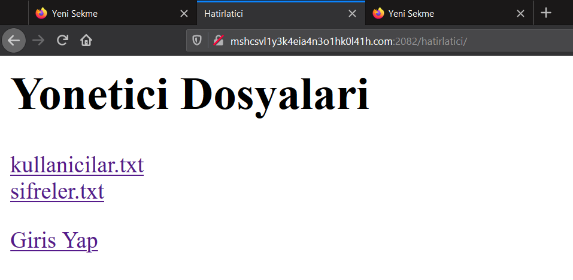
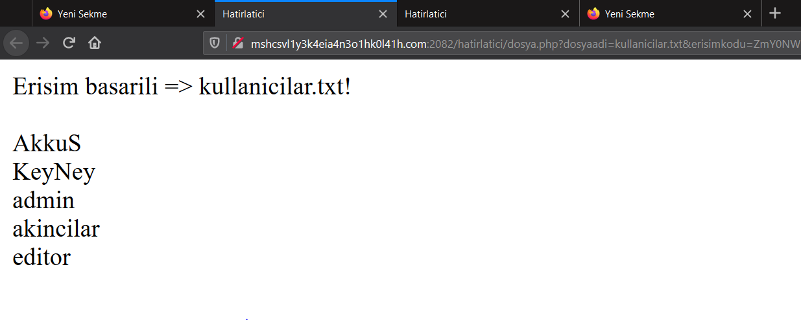
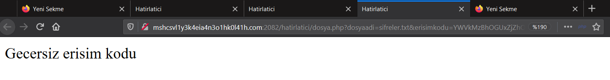
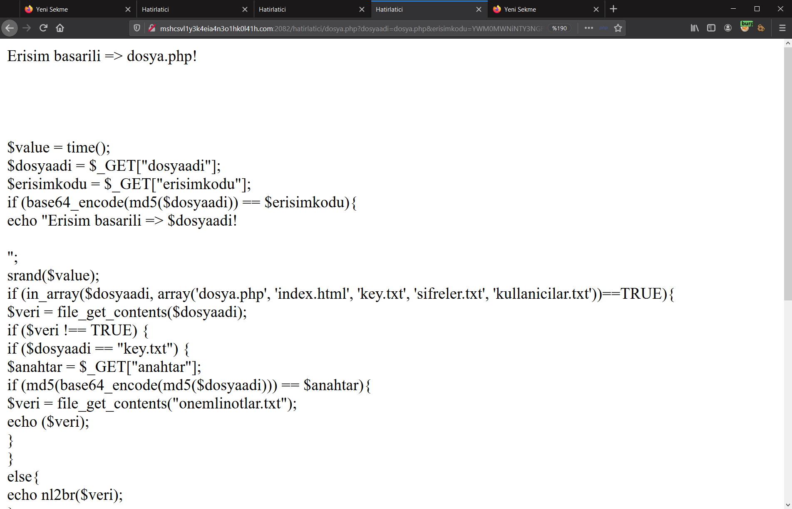
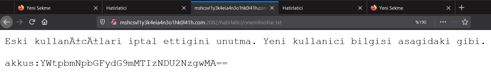
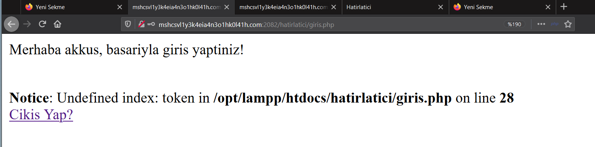
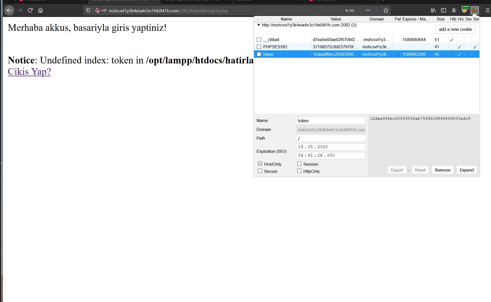
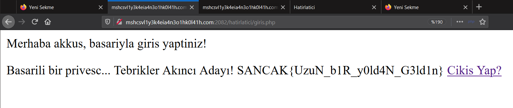

# Hatırlatıcı

Verilen web sayfasına girdiğimde görüntüdeki sayfayla karşılaştım. Kullanicilar.txt dosyasını okuyabilmeme rağmen sifreler.txtye girdiğimde `Gecersiz erisim kodu` hatası ile karşılaştım.


Daha sonra bağlantıyı incelediğimde erişim kodunu base64(md5(dosya_adi)) şeklinde oluşturduğunu görünce `sifreler.txt` için gerekli erişim kodunu oluşturdum ve okudum ancak dosyadaki şifreler çalışmıyordu. Sonrasında `dosya.php` üzerinden `dosyaadi` parametresiyle gerekli erişim kodunu oluşturdum.
`dosya.php` md5 -> `ac41cb5674acf94cc55c31cf2a5ad7db`
`ac41cb5674acf94cc55c31cf2a5ad7db` base64 -> `YWM0MWNiNTY3NGFjZjk0Y2M1NWMzMWNmMmE1YWQ3ZGI=`
Ardından gerekli isteği gönderdim ve tadaaa!

Kaynak kodunu burada satır satır açıklamak istemiyorum ancak `dosyaadi` parametresinin değeri `key.txt` ise `anahtar` isimli üçüncü bir parametre değerini alıyor ve bu değerin md5(base64(md5(dosya_adi))) değerine eşit ise `onemlinotlar.txt` yi döndürüyor. Şimdi burada yakaladığım diğer noktayı anlatacağım. `dosya.php` ile okuduğumuz dosyalar zaten `hatirlatici` dizininde. Yani direkt okuyabiliyoruz. Bu noktadan sonra anahtar oluşturmadan direkt `hatirlatici/onemlinotlar.txt` ile dosyaya erişebiliriz ki ben öyle yaptım.

Dosyada bana verdiği bilgileri ilk resimde gördüğünüz `Giris Yap` şeklinde linklenen giris.php üzerinde denedim ve giriş yaptım. Verilen parola base64 encodeddi bu yüzden decrypt etmem gerekiyordu. Parolayı decrypt ettiğimde `akkus` kullanıcısının parolasının `akincilartof1234567800` olduğunu öğrendim. Hemen ardından giriş sayfasında bu bilgilerle giriş yaptım.

Giriş yaptığımda basitçe içinde `token` geçen bir hata bastırdı. Sayfayı yenilediğimde hata kayboldu. Ardından cookielerde `token` isminde bir çerez oluşturulduğunu farkettim. Cookienin değeri `user`in SHA1 karşılığı olan `12dea96fec20593566ab75692c9949596833adc9` idi. 

Bende bu değeri hemen `admin`in SHA1 değeri olan `d033e22ae348aeb5660fc2140aec35850c4da997` ile değiştirdim. Sonrasında sayfayı yeniledim ve flagi elde ettim :)


Flag
```
SANCAK{UzuN_b1R_y0ld4N_G3ld1n}
```