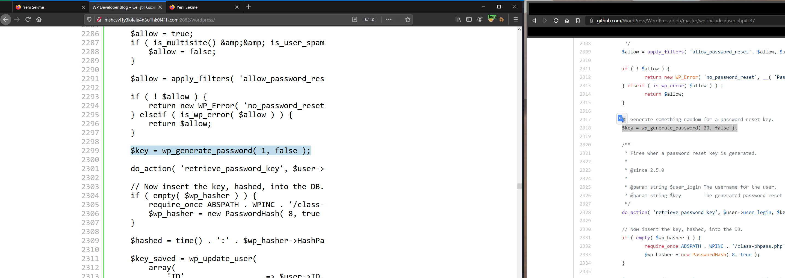
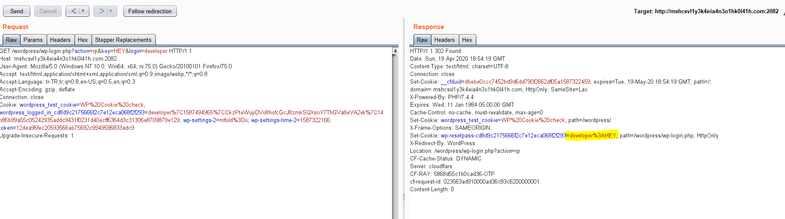
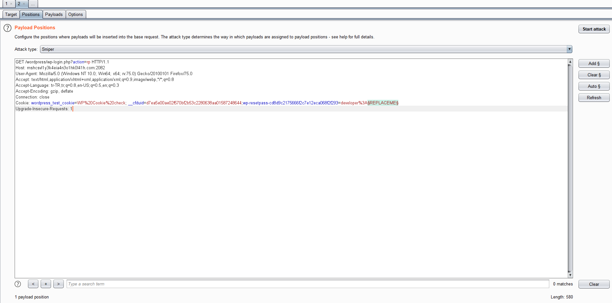
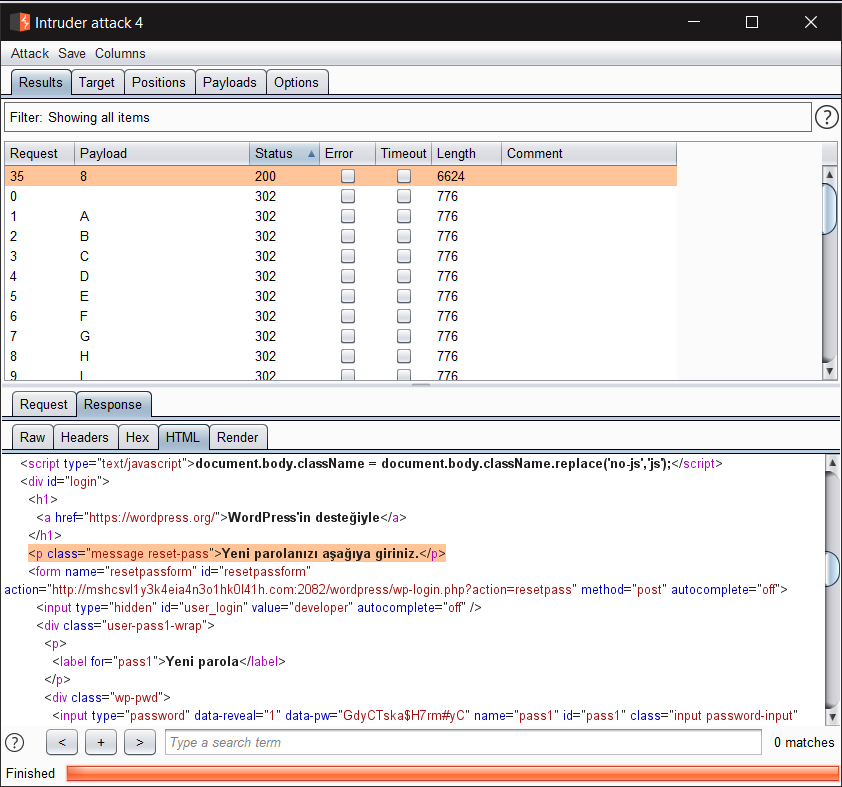
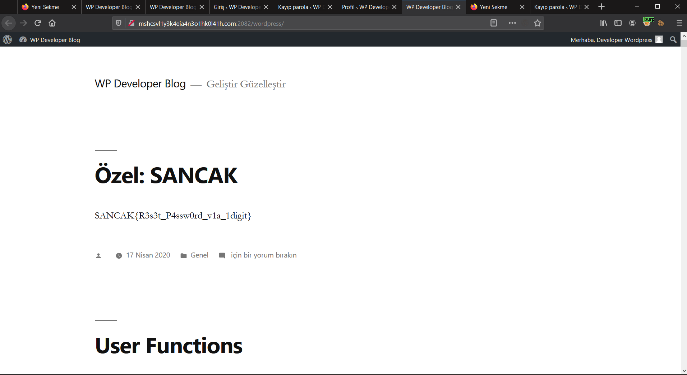

# JR. WP DEVELOPER
Verilen linke girdiğimde basit bir wordpress sayfasıyla karşılaştım. Burada `/wp-includes/user.php` de değişiklik yaptığını söylüyordu. Öncelikle wpscan sonucunda websayfasının wordpress sürümünü öğrendim. Sonrasında o sürüme ait aynı dosyayı github üzerinden indirdim ve `diff` aracı ile karşılaştırdım. Daha sonra önemli bir satırın farklı olduğunu farketttim. Bu satır reset password kısmıyla alakalıydı. Oluşturulan değerin uzunluğu 20den 1e düşürülmüştü.

Başta password reset isteği gönderdikten sonra yeni oluşturulan parolanın 1 hane uzunluğunda olacağını düşünüyordum. Biraz daha uğraştan sonra bunun password reset keyi olduğunu farkettim. Sonrasında araştırdım ve wordpresste password resetin işleyişini öğrendim. Öncelikle `http://mshcsvl1y3k4eia4n3o1hk0l41h.com:2082/wordpress/wp-login.php?action=rp&key=HEY&login=developer` isteği yolladım.

Bu request yalnızca cookie set edip asıl keyin kontrol edileceği `/wordpress/wp-login?action=rp` endpointine yönlendiriyordu. Sonrasında `Burp Intruder` kullanarak a-Z 0-9 bütün tek karakterleri denettirdim ve reset keyi elde ettim.


Sonrasında hemen passwordü sıfırlayıp giriş yaptım. Ardından flage ulaştım :)


Flag
```
SANCAK{R3s3t_P4ssw0rd_v1a_1digit}
```