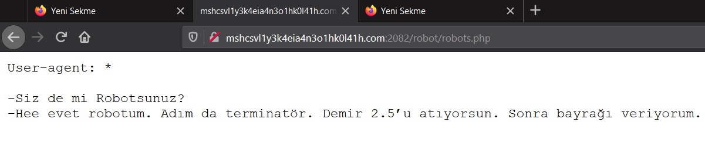
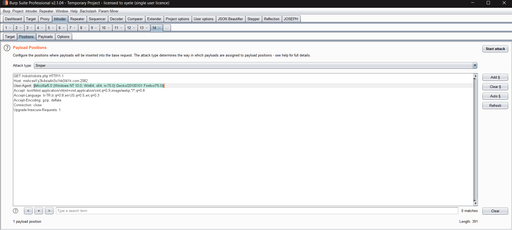
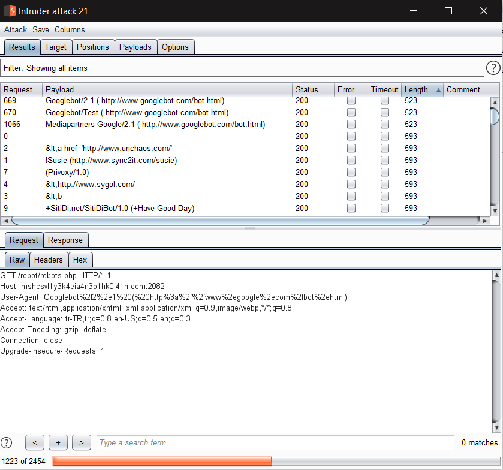
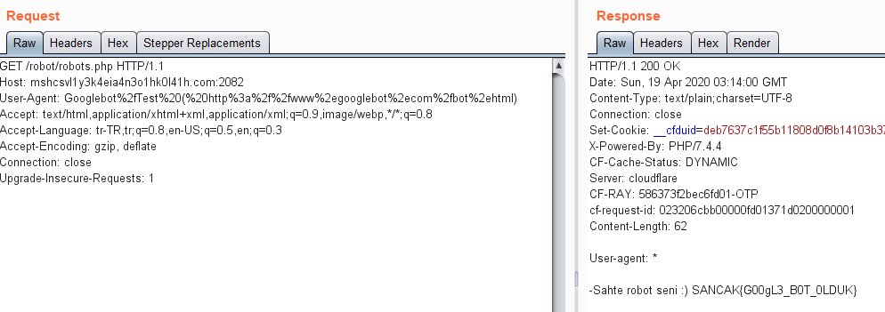

# ROBOT DEGIL BABAM OLSA TANIMAM!

Verilen web sayfasına girdiğimde karşımda yine Cem Yılmazla karşılaştım :) Bu soruda gerçekten çok vakit harcadım çok kafay yordum çünki bulmam gereken dosya wordlistimde yoktu. Soruda bolca Robot geçtiği için `User-Agent` değerine bot/robot hatta babam yazmayı bile denedim. `Robots.txt` dosyasınada baktım ancak birşey yakalayamadım. Sonrasında farklı bir wordlist ile `robots.php` dosyasını buldum.

Sayfada yine filmden bir alıntı yapılmıştı. İlk satırda verilen `User-agent: *` yazısını görünce isteğimin `User-agent` değerini değiştirmeye karar verdim. Birkaç denememden sonra başarısız olunca `Burp Intruder` aracılığı ile aşağıdaki listeyi denedim.

Intruderi başlattım ve giden requestlerden `GoogleBot` geçen requestlerin yanıtlarının uzunluğunun farklı olduğunu farkettim.

Sonrasında bu requestlerin yanıtlarına baktığımda ise flagi elde ettim. Sonuç olarak `User-Agent` değerinde `GoogleBot` geçmesi yeterliymiş :)


Flag
```
SANCAK{G00gL3_B0T_0LDUK}
```