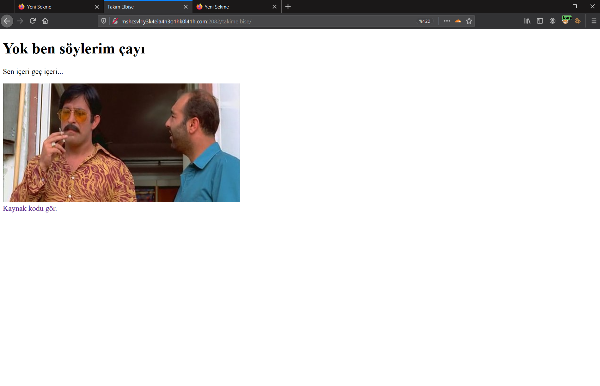
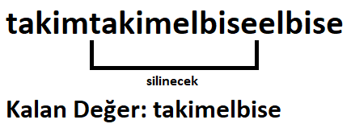
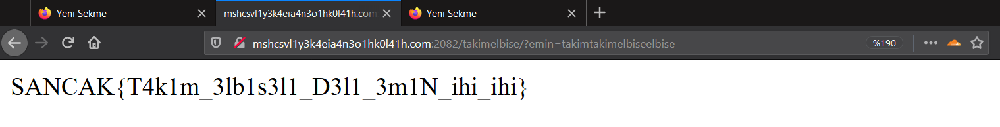

# TAKIM ELBISE
Verilen web sayfasına girdiğimde karşımda Cem Yılmazın oynadığı Vizontele filminden alıntılarla karşılaştım :)

Aşağıdaki linke tıkladığımda `?kaynak` hedefine yönlendiriyordu ve orada ise sayfanın kaynak kodu bizi karşılıyordu.
```PHP
<!DOCTYPE HTML>
<?php
  require("sancak.php");

  if (isset($_GET['kaynak'])) {
    highlight_file(__FILE__);
    die();
  }

  if (isset($_GET['emin'])) {

    $ne_dedi_ne_dedi = $_GET['emin'];
    $neyi_duymak_istemiyorsun = 'takimelbise';
    $sende_bunu_yedin = preg_replace(
            "/$neyi_duymak_istemiyorsun/", '', $ne_dedi_ne_dedi);

    if ($sende_bunu_yedin === $neyi_duymak_istemiyorsun) {
      sen_iceri_gec_iceri();
    }
  }
?>

<html>
  <head>
    <title>Takım Elbise</title>
  </head>
  <body>
    <h1>Yok ben söylerim çayı</h1>
    <p>Sen içeri geç içeri...</p>
    </div>
    
    <div>
    <a target="_blank" href="?kaynak">Kaynak kodu gör.</a>
  </body>
</html>
```
Kaynak kodunun yaptığı şey `emin` GET parametresinin değerini alıp `takimelbise` değerini boşlukla replace ettirip (sildirtip) çıkan değer tekrar `takimelbise`  değerine eşitse flagi döndürmek. Bunun atlatmak için biraz araştırmadan sonra bir yöntem olduğunu keşfettim.


Yöntem ile elde ettiğim `takimtakimelbiseelbise` değerini `emin` parametresine verince flagi elde ettim.


Flag
```
SANCAK{T4k1m_3lb1s3l1_D3l1_3m1N_ihi_ihi}
```