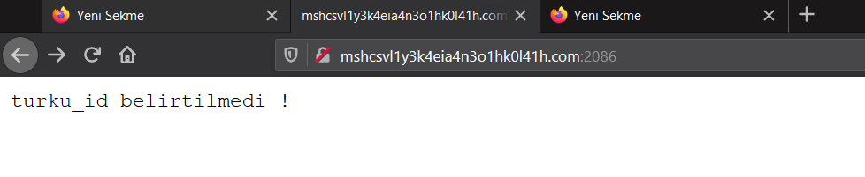
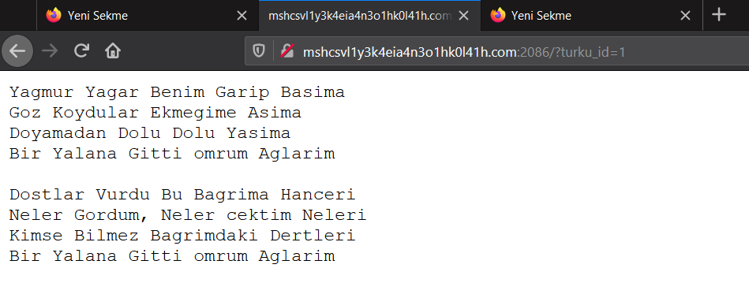
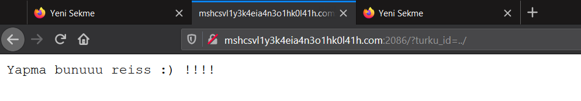
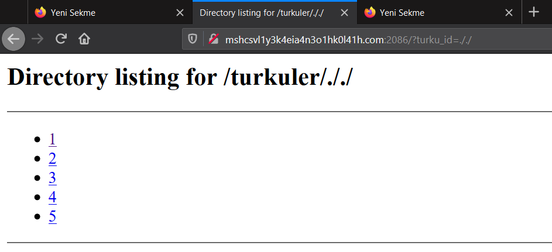
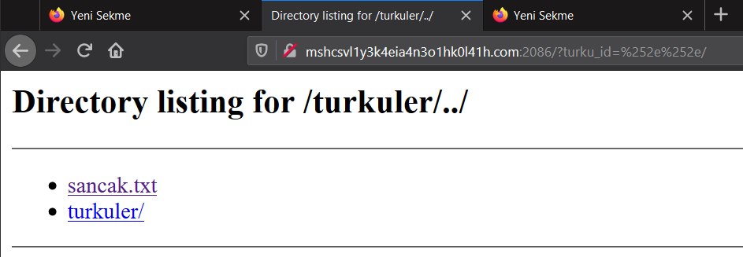
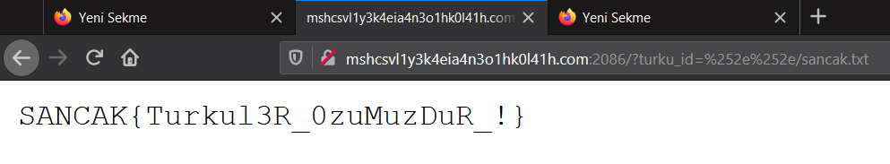

# TÜRKÜ SÖZLERİ NOKTA KOM
Verilen web sayfasına girdiğimde `turku_id belirtilmedi !` yazısıyla karşılaştım.

Daha sonra `turku_id` parametresine `1` değeri vererek bir istek gönderdim ve karşıma türkü döndürdü.

Bunu gördükten sonra `'` (tırnak) ile `sql injection` hemen denedim ancak başarısız oldum. Ardından parametredeki değere sahip bir dosya olduğunu ve dosyadan okduğunu farzederek `sancak` veya `sancak.txt` değerlerini denedim ve başarısız oldum. Birazcık daha kurcalamadan sonra `../` değeri verdiğimde bloklandığımı farkettim.

Ardından filtrelemenin yalnızca `..` değeri için olduğunu anladım ve `././` ile directory listining elde ettim.

Sonrasında biraz daha uğraştıktan sonra double url encoding methodu ile filtrelemeyi bypassladım.
`..`+"/" -> url encoded `%2e%2e`+"/"
`%2e%2e`+"/" -> url encoded `%25%32%65%25%32%65`+"/"

Arıdanan flagin olduğu dosyayı okumak için `%252e%252e/sancak.txt` payloadını kullandım ve flagi elde ettim.


Flag
```
SANCAK{Turkul3R_0zuMuzDuR_!}
```